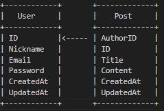

# BLOG API GO EXAMPLE
- creating blog api using go lang
## FEATURE 
1. Signup (Register)
2. Edit his account
3. Shutdown (Delete his account)
4. Create a blog post
5. Edit blog post created by him
6. View all blog posts
7. View a particular blog post
8. View other blog posts published by other users
9. Delete blog post created by him

## This API will be built with:
1. Go
2. GORM (A Golang ORM)
3. JWT
4. Postgres
5. Mysql
6. Gorilla Mux (For HTTP routing and URL matcher)

## SCHEMA
